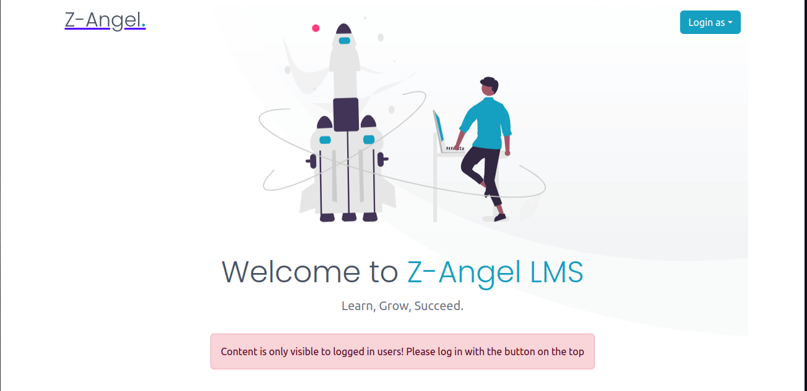
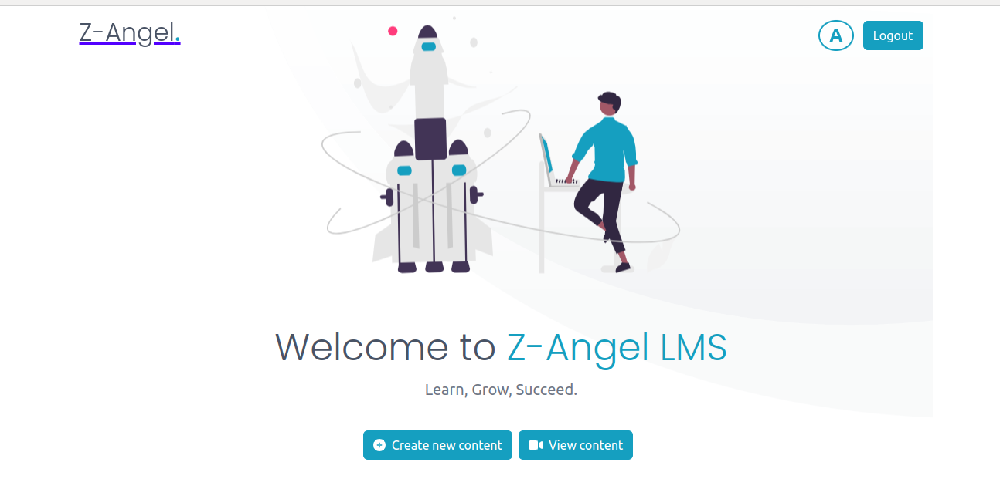
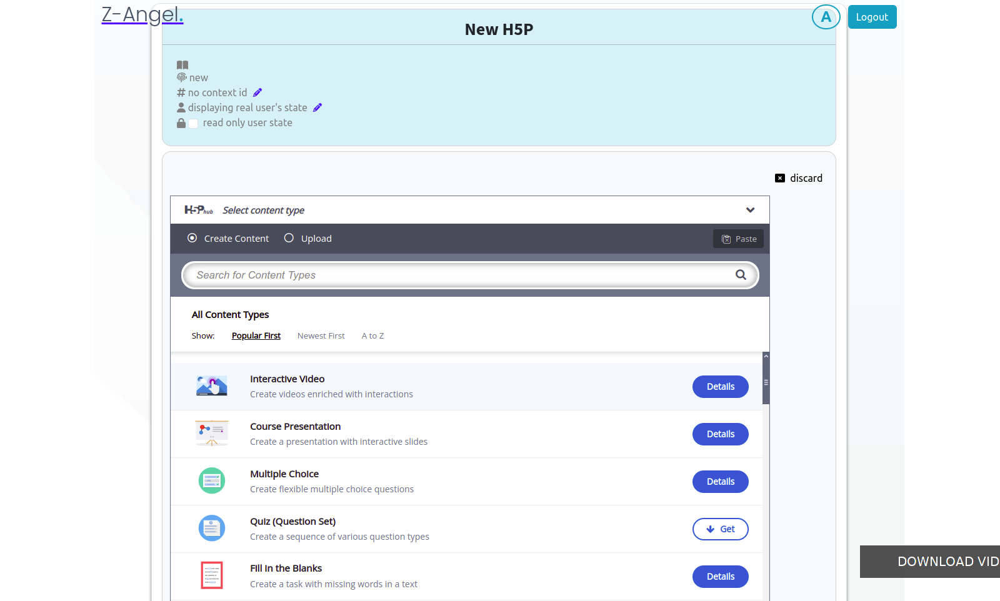
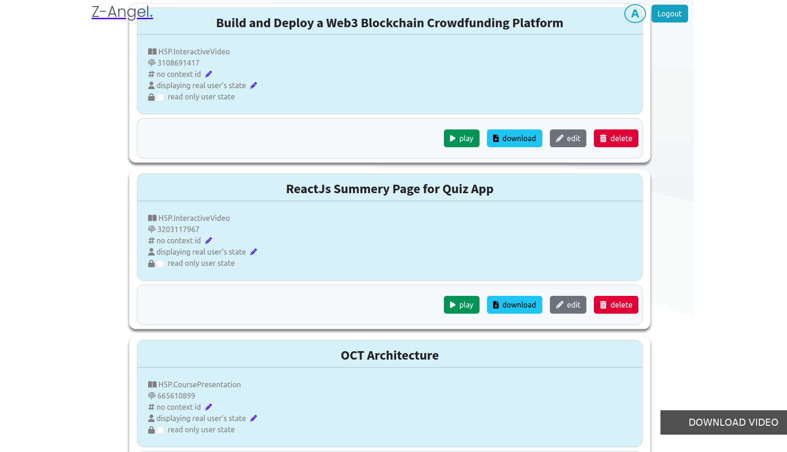
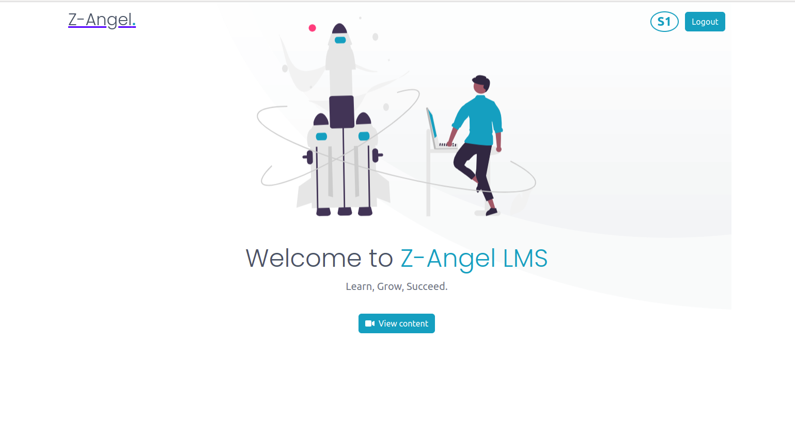
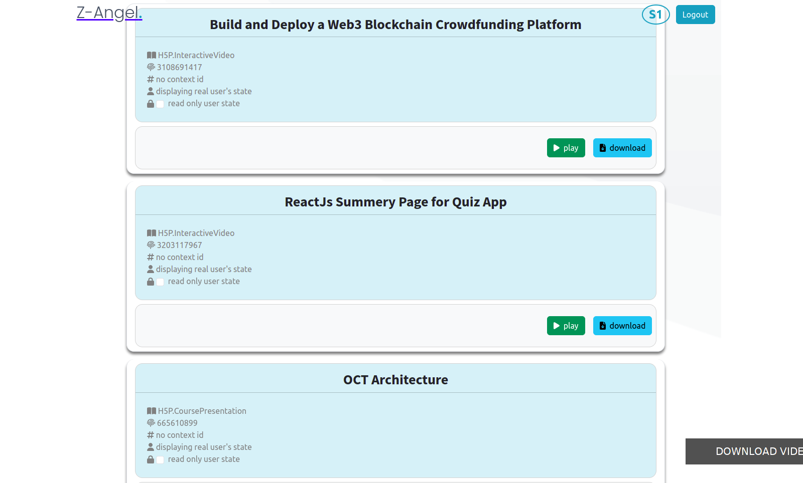

<a name="readme-top"></a>
<!-- PROJECT LOGO -->
<br />
<div align="center">
  <a href="https://github.com/super-mela/H5P-LMS">
    
  </a>

  <h3 align="center">Melaku Birhanu H5P Project</h3>

  <p align="center">
   This project build with the aim of to impliment H5P learing managmet on SAP using react and nodeJs  
    <br />
    <a href="https://github.com/Lumieducation/H5P-Nodejs-library"><strong>Explore the docs for H5P»</strong></a>
    <br />
    <br />
    <a href="https://github.com/super-mela/H5P-LMS">View Demo</a>
    ·
    <a href="https://github.com/super-mela/H5P-LMS/issues">Report Bug</a>
  </p>
</div>


<!-- TABLE OF CONTENTS -->
<details>
  <summary>Table of Contents</summary>
  <ol>
    <li>
      <a href="#about-the-project">About The Project</a>
      <ul>
        <li><a href="#built-with">Built With</a></li>
      </ul>
    </li>
    <li>
      <a href="#getting-started">Getting Started</a>
      <ul>
        <li><a href="#prerequisites">Prerequisites</a></li>
        <li><a href="#installation">Installation</a></li>
      </ul>
    </li>
    <li><a href="#usage">Usage</a></li>
    <li><a href="#contributing">Contributing</a></li>
    <li><a href="#license">License</a></li>
    <li><a href="#contact">Contact</a></li>
  </ol>
</details>


<!-- ABOUT THE PROJECT -->
## About The Project

<div align="center">
      
</div>

Z-angel LMS (Learning Management System) is a powerful and versatile e-learning solution that combines the flexibility of H5P content types with the comprehensive features of a Learning Management System. It provides educators, trainers, and organizations with a seamless platform to create, deliver, and manage interactive and engaging learning content.

With H5P LMS, instructors can easily design interactive courses and modules using a wide range of H5P content types, such as quizzes, presentations, interactive videos, interactive presentations, and more. These content types enable learners to actively participate in the learning process, enhancing their understanding and knowledge retention.

One of the key advantages of using H5P LMS is its compatibility with various Learning Management Systems, making it easy to integrate into existing e-learning environments. Whether it's Moodle, WordPress, Drupal, or other supported platforms, H5P LMS smoothly integrates with the LMS, providing a seamless experience for both instructors and learners, so from it's reputaion of H5P it make Z-angel LMS more user frendly and easy access to all users.

The platform also offers robust analytics and reporting tools, allowing educators to track learners' progress, identify areas for improvement, and gain valuable insights into the effectiveness of their content. Additionally, H5P LMS supports gamification elements, badges, and certificates, further motivating learners and enhancing their learning experience.

<p align="right">(<a href="#readme-top">back to top</a>)</p>


### Built With

This project Built with diffrent frameworks and runtime enviroment. those are...

* [![React][React.js]][React-url]
* [![Bootstrap][Bootstrap.com]][Bootstrap-url]
* [![NodeJs][NodeJs-com]][NodeJs-url]
* [![ExpressJs][Expressjs.com]][ExpressJs-url]

<p align="right">(<a href="#readme-top">back to top</a>)</p>


<!-- GETTING STARTED -->
## Getting Started

If you want to set up this project on your local machine. To get a local copy up and running follow these simple steps.

### Prerequisites

This is how to install the framworks and RE and run the project in local machine.
* nodeJs [https://nodejs.org](https://nodejs.org)
* npm
  ```sh
  npm install npm@latest -g
  ```

### Installation

_Below is an example of how you can instruct your audience on installing and setting up your app. This template doesn't rely on any external dependencies or services._

1. Clone the repo
   ```sh
   git clone https://github.com/super-mela/H5P-LMS.git
   ```
2. Install NPM packages
   ```sh
   npm install
   ```
4. Start
   ```sh
   npm start
   ```

<p align="right">(<a href="#readme-top">back to top</a>)</p>


<!-- USAGE EXAMPLES -->
## Usage

To use Z-angel LMS there is no need any extra skill and knowledge. first you need to login to the system from the give user types, for example if you need to access as Administrator/ Teacher you just selcet those options from the `login as` list. from those user you can creat content and view content.

<div align="center">
      
</div>

now you can click the create new content button then you can access the the editor window. from the list of diffrent content type you can select that one you are interested on and fill the requred information for the coures.(if the content type in not installed you can install by clicking get button)

<div align="center">
      
</div>

the other option you can get from those users means Admin/Teacher you can see the content by clicking view content, from that you get a list of content that adds on the system. from this you can play, download, edit and delete the content.

<div align="center">
      
</div>

the other login option is as student you can select the student option from the Login as button. if you are logged in as a sudent the option you can get is only View content no other thing.

<div align="center">
      
</div>

After clicking the view content button you get alist of diffrent content that found in the system, but as a student the option you have is only play and download.

<div align="center">
      
</div>

_For more examples, please refer to the [Documentation](https://example.com)_

<p align="right">(<a href="#readme-top">back to top</a>)</p>

<!-- CONTRIBUTING -->
## Contributing

Contributions are what make the open source community such an amazing place to learn, inspire, and create. Any contributions you make are **greatly appreciated**.

If you have a suggestion that would make this better, please fork the repo and create a pull request. You can also simply open an issue with the tag "enhancement".
Don't forget to give the project a star! Thanks again!

1. Fork the Project
2. Create your Feature Branch (`git checkout -b feature/AmazingFeature`)
3. Commit your Changes (`git commit -m 'Add some AmazingFeature'`)
4. Push to the Branch (`git push origin feature/AmazingFeature`)
5. Open a Pull Request

<p align="right">(<a href="#readme-top">back to top</a>)</p>


<!-- LICENSE -->
## License

Distributed under the MIT License. See `LICENSE.txt` for more information.

<p align="right">(<a href="#readme-top">back to top</a>)</p>


<!-- CONTACT -->
## Contact

contact name - [Melaku Birhanu](https://www.linkedin.com/in/melaku-birhanu-187916236/) - genuieman@gmail.com

Project Link: [https://github.com/super-mela/H5P-LMS](https://github.com/super-mela/H5P-LMS)

<p align="right">(<a href="#readme-top">back to top</a>)</p>

<!-- MARKDOWN LINKS & IMAGES -->
<!-- https://www.markdownguide.org/basic-syntax/#reference-style-links -->
[contributors-shield]: https://img.shields.io/github/contributors/othneildrew/Best-README-Template.svg?style=for-the-badge
[contributors-url]: https://github.com/othneildrew/Best-README-Template/graphs/contributors
[forks-shield]: https://img.shields.io/github/forks/othneildrew/Best-README-Template.svg?style=for-the-badge
[forks-url]: https://github.com/othneildrew/Best-README-Template/network/members
[stars-shield]: https://img.shields.io/github/stars/othneildrew/Best-README-Template.svg?style=for-the-badge
[stars-url]: https://github.com/othneildrew/Best-README-Template/stargazers
[issues-shield]: https://img.shields.io/github/issues/othneildrew/Best-README-Template.svg?style=for-the-badge
[issues-url]: https://github.com/othneildrew/Best-README-Template/issues
[license-shield]: https://img.shields.io/github/license/othneildrew/Best-README-Template.svg?style=for-the-badge
[license-url]: https://github.com/othneildrew/Best-README-Template/blob/master/LICENSE.txt
[linkedin-shield]: https://img.shields.io/badge/-LinkedIn-black.svg?style=for-the-badge&logo=linkedin&colorB=555
[linkedin-url]: https://linkedin.com/in/othneildrew
[product-screenshot]: public/assets/screenshoot//screenshot.png
[Next.js]: https://img.shields.io/badge/next.js-000000?style=for-the-badge&logo=nextdotjs&logoColor=white
[Next-url]: https://nextjs.org/
[React.js]: https://img.shields.io/badge/React-20232A?style=for-the-badge&logo=react&logoColor=61DAFB
[React-url]: https://reactjs.org/
[Vue.js]: https://img.shields.io/badge/Vue.js-35495E?style=for-the-badge&logo=vuedotjs&logoColor=4FC08D
[Vue-url]: https://vuejs.org/
[Angular.io]: https://img.shields.io/badge/Angular-DD0031?style=for-the-badge&logo=angular&logoColor=white
[Angular-url]: https://angular.io/
[Svelte.dev]: https://img.shields.io/badge/Svelte-4A4A55?style=for-the-badge&logo=svelte&logoColor=FF3E00
[Svelte-url]: https://svelte.dev/
[Laravel.com]: https://img.shields.io/badge/Laravel-FF2D20?style=for-the-badge&logo=laravel&logoColor=white
[Laravel-url]: https://laravel.com
[Bootstrap.com]: https://img.shields.io/badge/Bootstrap-563D7C?style=for-the-badge&logo=bootstrap&logoColor=white
[Bootstrap-url]: https://getbootstrap.com
[JQuery.com]: https://img.shields.io/badge/jQuery-0769AD?style=for-the-badge&logo=jquery&logoColor=white
[NodeJs-url]: https://nodejs.org 
[NodeJs-com]:https://img.shields.io/badge/Node-js?style=for-the-badge&logo=nodedotjs&logoColor=white
[ExpressJs-url]: https://expressjs.com
[Expressjs.com]:https://img.shields.io/badge/Express-js?style=for-the-badge&logo=Express&logoColor=black&color=4FC08D


